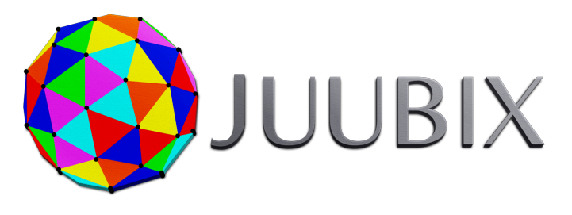
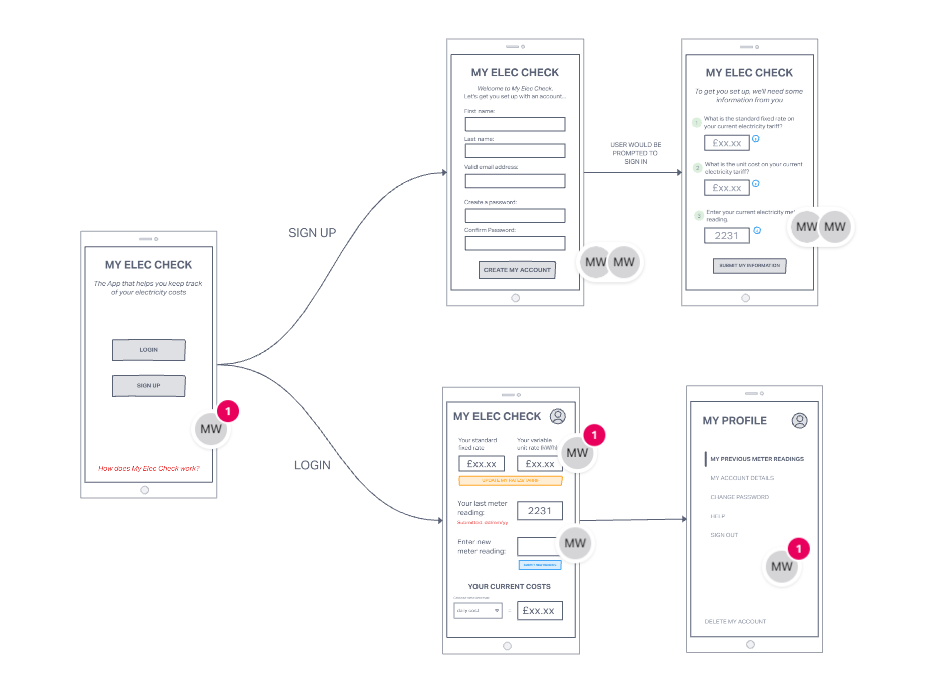

### Hi, I'm Matt :wave: 

I'm a frontend web developer, currently living in Luton, UK.  

I love to solve problems, create modern, user-centric web pages and apps, and I have a relentless drive to be the best programmer I can!

Having worked in both the private and public sectors, I have a wealth of experience which I can leverage as a programmer: communication, teamwork, project management, process improvement, relationship-building, stakeholder management, and leadership. 

If you would like to discuss job opportinuties, a new collaboration, my projects, or simply say hi, please reach out.

### Where to find me:

  
  &nbsp;
  
  &nbsp;
  

----

### RECENT PROJECTS AND CONTRIBUTIONS

 :fire:**FINSWEET - A REACT APP**

My first solo `React` Project! 

I've absolutely loved building _Finsweet_, taking a `Figma` design file and bringing it to life.  This is an evolving piece of work and with the guidance of a fantastic mentor, I continue to explore new functionality and expand the scope of the project.

   
  &nbsp;
  

##     
 :fire:**JUUBIX COLLABORATION**

I've had the pleasure of working with a group of developers, alongside the company CEO, to create and develop a new product to support the company's main proposition. Although not leading the project, I've been able to used my transferable skills to help refine the development process and define the desired outcomes of the project.

##   

 :fire:**MY ELEC CHECK**

**_An app to help keep monitor your electricity use in a time of ever-increasing living-costs_**

This new project, currently work-in-progress, showcases my `JavaScript` knowledge.  Working on _My ELEC CHECK_ has given me the opportunity to work through a full development cylce, from conceptualisation to final product creation and deployment.  Working with an experienced developer, this project has provided the opportunutiy to collaboarate, partake in code reviews and use feedback to improve my programming.

   
  &nbsp;
  

----

### CURRENT TECH STACK:
###   

	
	 &nbsp;
	 &nbsp;
	 &nbsp;
	 &nbsp; 
	 &nbsp; 
	 &nbsp;
	 &nbsp;
	 &nbsp;
	 &nbsp;
	
  

  

 I have strong knowledge of `HTML`, `CSS` and `JavaScript`, and with the growing number of projects that I am working on, I have made a conscious effort to use and implement related libraries and frameworks, such as `Sass`, `Bootstrap`, `Material UI` and `React`.

    
### WHAT I'M CURRENTLY LEARNING/CONTINUING TO LEARN:
###   

	 &nbsp;
	 &nbsp;
	 &nbsp;
	 &nbsp;
	

  

 Embracing the notion of life-long learning, I acknowledge that I need to continuously developing my progamming skills.  As such, I continue to dig deeper into the `JavaScript` ecosystem.  Along side this, I am building new projects to deepen my knowledge of `React` and `Redux`.  Although my current focus is on FrontEnd Development, I want to build a better understanding of backend technologies, but also expand my knowledge of `software testing`.  I'm also a keen designer, and so I want to become more familiar with `Figma` in order to better contribute to the conceptualisation and wireframing of future projects.

### WHAT'S COMNIG NEXT:

	 &nbsp;
	

    

---

### LATEST BLOG POSTS

**My Parachute into Tech** - [READ HERE](https://mattwillis.dev/blog-page.html)

_[WORK IN PROGRESS]_
